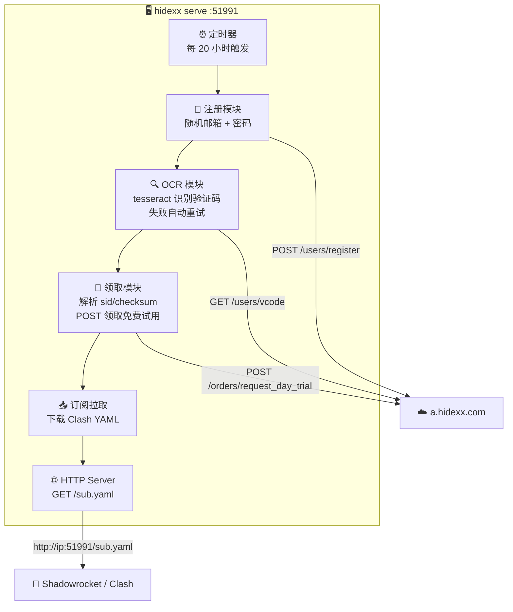

# Hidexx

每天自动注册 → OCR 破解验证码 → 领取免费试用 → HTTP 分发订阅配置。

手机 Shadowrocket / Clash 配置一次订阅 URL，之后永久自动更新节点。

## 架构



## 依赖

- Go 1.21+
- [tesseract-ocr](https://github.com/tesseract-ocr/tesseract) — 验证码识别

```bash
# macOS
brew install tesseract

# Ubuntu / Debian
apt install -y tesseract-ocr
```

## 安装

```bash
git clone https://github.com/xaioaoao/hidexx.git
cd hidexx
go build -o hidexx .
```

## 命令

| 命令 | 说明 |
|------|------|
| `hidexx serve -p 51991` | **主命令**：后台常驻，自动续命 + HTTP 分发订阅 |
| `hidexx daily` | 一次性：注册 → 领取 → 输出订阅链接 |
| `hidexx login` | 仅登录测试 |
| `hidexx claim` | 登录 + 领取试用（需先配置账号） |
| `hidexx sub` | 登录 + 输出订阅链接 |

### hidexx serve

核心命令。启动后自动执行完整流程，并通过 HTTP 对外提供最新的 Clash YAML 配置。

```bash
./hidexx serve -p 51991
```

```
=== hidexx subscription server ===

listening on 0.0.0.0:51991

Shadowrocket config (one-time setup):
  URL: http://192.168.x.x:51991/sub.yaml
```

每 20 小时自动注册新账号 + 领取试用 + 更新订阅。

### hidexx daily

一次性执行，输出订阅链接和账号信息：

```bash
./hidexx daily --line 1    # 王者套餐（默认）
./hidexx daily --line 11   # 青铜套餐
```

### login / claim / sub

需要先配置账号，支持三种方式：

```bash
# 方式一：配置文件 ~/.hidexx.yaml
base_url: https://a.hidexx.com
email: your@email.com
password: your_password

# 方式二：环境变量
export HIDEXX_EMAIL=your@email.com
export HIDEXX_PASSWORD=your_password

# 方式三：命令行参数
./hidexx login --email your@email.com --password your_password
```

## 部署

### macOS（本机）

```bash
# 编译
go build -o hidexx .

# 启动后台服务（开机自启）
# 编辑 LaunchAgent plist 中的路径和端口后：
cp com.liao.hidexx.plist ~/Library/LaunchAgents/
launchctl load ~/Library/LaunchAgents/com.liao.hidexx.plist

# 查看日志
tail -f ~/.hidexx-serve.log

# 停止
launchctl unload ~/Library/LaunchAgents/com.liao.hidexx.plist
```

### Linux 服务器

```bash
# Mac 上交叉编译
GOOS=linux GOARCH=amd64 go build -o hidexx-linux .

# 传到服务器
scp hidexx-linux yourserver:/usr/local/bin/hidexx

# 服务器上安装 tesseract
apt install -y tesseract-ocr

# systemd 服务
cat > /etc/systemd/system/hidexx.service << 'EOF'
[Unit]
Description=Hidexx auto-proxy subscription server

[Service]
ExecStart=/usr/local/bin/hidexx serve -p 51991
Restart=always

[Install]
WantedBy=multi-user.target
EOF

systemctl enable --now hidexx
```

## 手机配置（一次性）

### Shadowrocket (iOS)

1. 打开 Shadowrocket → 底栏 **配置** → 右上角 **+**
2. URL 填：`http://<IP>:51991/sub.yaml`
3. 点 **下载** → 选中该配置
4. 回首页开启连接

### Clash (Android / Mac / Windows)

Settings → Profiles → New → URL 填 `http://<IP>:51991/sub.yaml` → Save

之后节点自动更新，无需任何手动操作。
